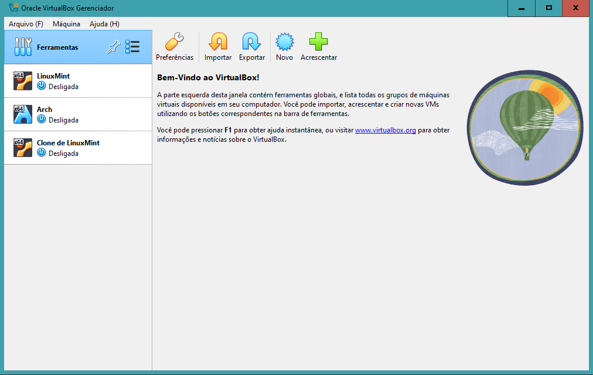
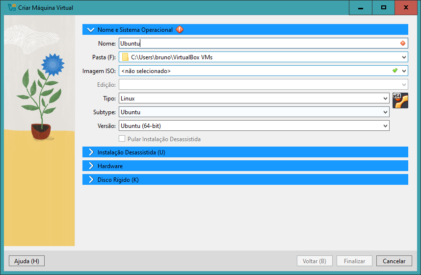
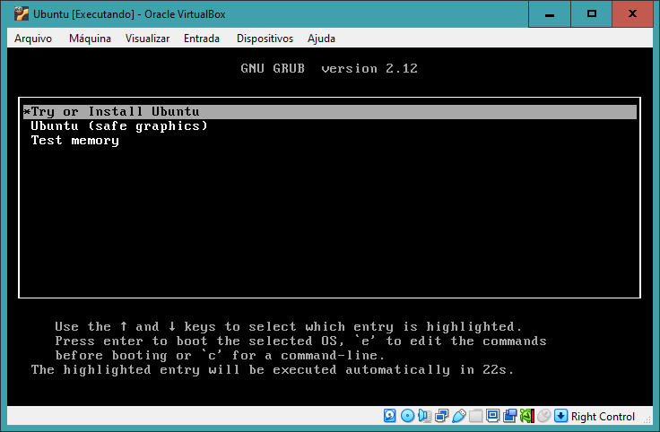
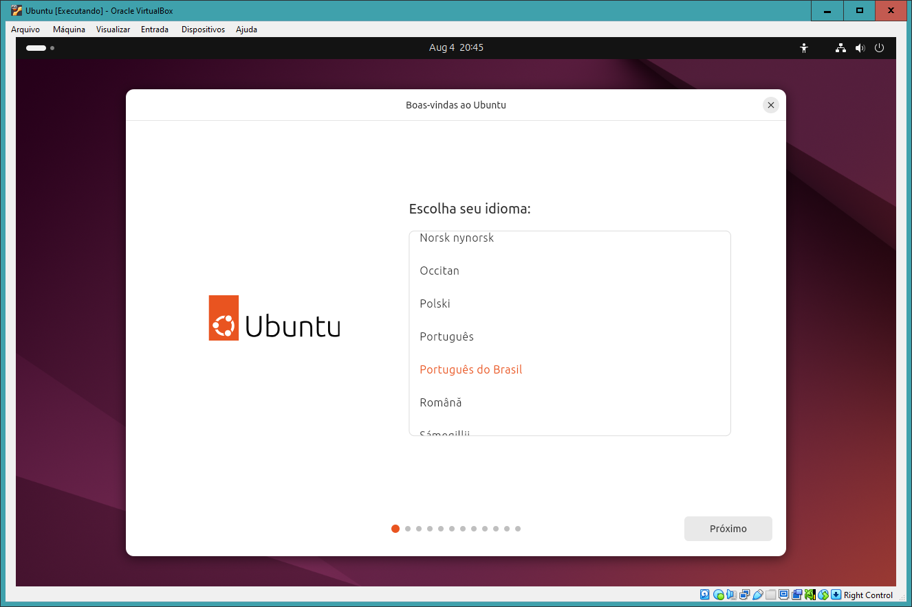

# Configuração do Ambiente

A primeira etapa consiste na instalação e configuração do programa de virtualização que será utilizado e na instalação e configuração também do sistema operacional Ubuntu. 

## Instalação do software de virtualização

O software de virtualização escolhido foi o Oracle VirtualBox.

Vá para o link do [Oracle VirtualBox](https://www.virtualbox.org/) e clique no botão de download para baixar o instalador do VirtualBox, após isso realize a instalação do software de acordo o passo a passo do instalador.

Após esse procedimento você pode abrir o programa e deve se deparar com a tela inicial do VirtualBox:

## Download da imagem do Ubuntu

Para baixar a imagem do Ubuntu, que será necessaria para a instalação do sistema operacional, clique em [Ubuntu](https://ubuntu.com/download) para acessar a página de downloads. Existem diferentes versões do Ubuntu e métodos de instalação disponiveis na página, para os nossos propósitos qualquer versão Desktop pode ser utilizada, porém recomenda-se o download da versão mais recente LTS. Aguarde finalizar o download.

## Criando a máquina virtual

Com o Oracle VirtualBox aberto na tela inicial, clique no botão azul escrito "**Novo**" para criar uma nova máquina virtual. Então aparecerá uma nova janela com algumas abas e diversos campos para serem preenchidos, na aba de "**Nome e sistema operacional**" digite Ubuntu no campo nome e os outros serão preenchidos automaticamente. Após isso vá para a aba "**Hardware**" e selecione a quantidade de memória RAM e núcleos da CPU do seu computador que a máquina virtual terá acesso. Por último vá para a aba "**Disco Rígido**" onde você pode opcionalmente alterar o diretório local onde o VirtualBox usará como disco para a máquina virtual, caso não queira alterar pode deixer o padrão. Clique em "**Finalizar**".

## Instalação do Ubuntu

Inicie a máquina virtual clicando sobre ela e após isso em "**Iniciar**", aparecerá uma mensagem falando que não foi encontrada mídia bootavel e pedindo para selecionar alguma, então navegue até o seu arquivo de imagem .iso do Ubuntu que você fez o download e dê um clique duplo sobre ele. Então aguarde a inicialização até que apareça uma tela em modo texto com algumas opções, aperte Enter com a primeira opção selecionada.

Seguindo o sistema iniciará em modo gráfico, onde você pode seguir o que for solicitado no passo a passo de instalação do sistema operacional normalmente.

Após a instalação, vá até as configurações da máquina virtual criada, clique em "**Sistema**" e certifique-se de que a ordem de boot do sistema fará com que ele inicie com o sistema operacional instalado no disco.

Isso finaliza a etapa 1 **Configuração do Ambiente** para seguir clique em [próximo](SERVIDORWEB.md).