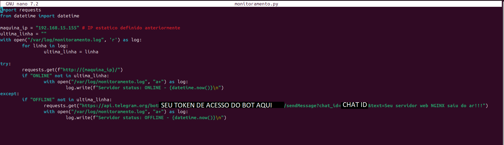

# Monitoramento e Notificações

Essa é a terceira etapa do projeto, o objetivo é criar um script para monitorar se o serviço do nosso servidor está ativo ou não, e se caso não, notificar o responsável via bot do Telegram.

## Criando os arquivos

Navegue até o diretório "**/var/log/**" com o comando "**cd**" e crie com "**touch**" o arquivo "**monitoramento.log**", nesse arquivo manteremos registro de paradas e inicializações do serviço.

Crie um diretório para armazenar o script, nesse caso vou criar um diretório "**/var/script**" utilizando do comando "**mkdir /var/script**" (lembrando que a permissão de usuario root ainda é necessaria), com ele criado acesse usando o comando "**cd**", a criação do programa pode ser realizada com qualquer linguagem e ferramenta disponível, para esse propósito estarei usando "**python**". 

Digite o comando "**touch monitoramento.py**" para gerar o arquivo em que será escrito o script.

## Adquirindo bot do Telegram

Como o meio de notificações adotado foi o Telegram, antes de escrever o código do programa é preciso criar o bot que será o canal de notificação, guardar o token de acesso do bot, guardar o código de identificação do nosso chat com o bot, além de criar uma conta no Telegram caso não possua.

Conectado no aplicativo, pesquise na caixa de busca por "**BotFather**", aparecerá na primeira opção o bot oficial do Telegram com um selo, com ele é possível registrar e administrar bots.

Inicie a conversa com ele, em seguida digite ou clique em "**/newbot**" para criar um novo bot, o BotFather irá pedir por algumas informações como o nome de exibição do seu bot e um nome de usuário dele, após isso ele retornará uma mensagem indicando que o seu bot foi criado com sucesso, juntamente a esta mensagem estará o token de acesso, você precisa guardar esse token de acesso.

Outra informação que será necessária é o código da nossa conversa com o nosso bot recém-criado. Para conseguir essa informação, primeiramente é preciso iniciar a conversa com ele.

No chat com o "**BotFather**", ainda na resposta que ele entrega ao finalizar a criação de um bot novo, estará um link que se parece com "**t.me/BrunoMonitoramentoBot**". Clique nesse link e ele te levará até a conversa com o seu bot. Lá, aperte em iniciar, a conversa estará iniciada. Para garantir, mande uma mensagem qualquer no chat.

Agora, para ler o código dessa conversa, é necessário enviar uma requisição https usando o token de acesso que foi obtido, o endereço é "**https://api.telegram.org/bot{seu-token-aqui}/getUpdates**", ela pode ser enviada pelo próprio navegador ou qualquer outra ferramenta para isso. Como resposta, vira um arquivo JSON com algumas informações, o que precisamos buscar é "id" dentro de "chat" dentro de "message" e esses campos estarão em "result" (caso esteja vazio, mande uma mensagem para o bot no Telegram e recarregue a página!). Salve essa informação de "id" também.

## Escrevendo python

Agora abra com o editor de texto o arquivo "**monitoramento.py**", nas primeiras linhas do código, escreva as linhas de importações de bibliotecas, importando "datetime" e "requests".

Iniciando com o código de fato, armazene em uma variável o endereço de IP estático que definimos anteriormente.

No próximo passo, vamos carregar em memória a última linha do arquivo de log que criamos. Declare e inicialize uma variável que vai conter a última linha, abra o arquivo do log em modo de leitura e itere linha por linha até a última, registrando essa na variável.

Continuando, abra um bloco try-except que tentará a conexão com a nossa página e lidará com a exceção. Dentro do bloco try, com "**requests.get(f"http://{maquina_ip}/")**", nós estaremos tentando a conexão com o nosso próprio IP para receber a página web. No caso de sucesso, verifique se a última linha do log não contém a palavra "ONLINE". Nesse caso, abra o arquivo do log em modo "append" e escreva uma linha nova para ser adicionada ao log indicando que o serviço está online e funcional. É recomendado adicionar a data e hora atual no registro do log, para isso se utiliza a biblioteca "**datetime**".

Já no caso de fracasso da requisição HTTP, verifique se a última linha do log não contém a palavra "OFFLINE", nesse caso precisamos notificar o administrador via bot do telegram e escrever no log o novo estado do servidor que é indisponível ou offline, para isso envie uma requisição GET para o endpoint da API do Telegram, o endereço é "**https://api.telegram.org/bot[SEU TOKEN DE ACESSO DO BOT AQUI]/sendMessage?chat_id=[SEU ID DO CHAT AQUI]&text=[SUA MENSAGEM QUE O BOT ENVIARÁ]**", substituindo devidamente com as suas informações, isso deve enviar a mensagem via Telegram. Após isso, ainda é importante abrir o arquivo log em modo "append" e adicionar uma nova linha informando que o servidor está offline e novamente informando a data e hora com a biblioteca "**datetime**".

[Clique para ver o script Python aqui.](monitoramento.py)

## Programando a execução

Nesse passo, vamos programar para que a execução do "**monitoramento.py**" seja realizada automaticamente a cada 1 minuto, dessa forma a funcionalidade de monitoramento do servidor web estará pronta.

Para criar uma tarefa sendo executada de tempos em tempos, digite o comando "**crontab -e**", ele dará as opções e pedirá para que você selecione o editor de texto que deseja usar, selecione o que se sentir mais confortável.

Automaticamente será aberto o editor de texto escolhido com vários comentários explicando o funcionamento do comando, basicamente são seis valores de entrada que correspondem a [minuto] [hora] [dia do mês] [mês] [dia da semana] [comando que será executado]. Dessa forma, digite "* * * * * /usr/bin/python3 /var/script/monitoramento.py", isso quer dizer que em qualquer minuto ele vai executar o arquivo de python.

Um último detalhe é tornar o arquivo python executável, use o comando "**chmod +x /var/script/monitoramento.py**".

Isso finaliza a etapa 3, "**Monitoramento e Notificações**". Para seguir, clique em [próximo](TESTES.md).
