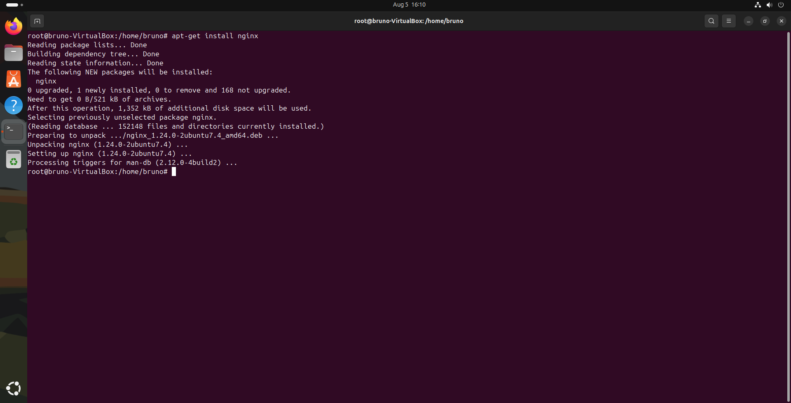
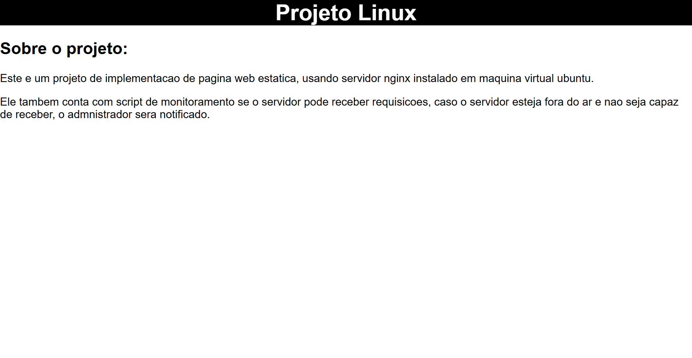
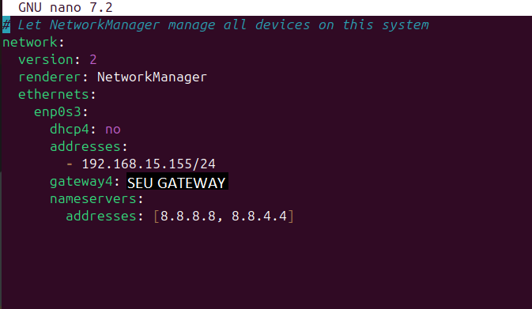

# Configuração do Servidor Web

A segunda etapa consiste na instalação e na configuração do software **Nginx** que será utilizado para servir requisições de página web. 

## Entrando como usuário root

Caso não esteja iniciada, inicie a máquina virtual e abra o seu terminal, com o terminal aberto digite o comando "**sudo su**" para entrar como usuário _root_, será pedido a senha de acesso do seu usuário para autentificação, essa senha foi definida durante a instalação do sistema operacional, insira a senha e você estará logado como usuário root.

## Instalação do Nginx

O processo de instalação é bem simples, digite o comando "**apt update**" para atualizar a base de pacotes disponíveis para serem instalados com o gerenciador de pacotes **apt**, e então digite comando "**apt-get install nginx**", aparecerá uma mensagem na tela pedindo confirmação da instalação, aceite e aguarde o término do processo.

Você pode utilizar um comando "**service nginx status**" para verificar se o serviço está instalado corretamente e está ativo.

## Criando arquivo HTML

Navegue para o diretório "**/var/www/html**" usando o comando "**cd /var/www/html**", com o comando "**ls**" é possível ver que só existe o arquivo "**index.nginx-debian.html**", para criar o arquivo .html da nossa página, use o comando "**nano index.html**" que abrirá o editor de texto para criação do "**index.html**", a configuração padrão do nginx faz que automaticamente ele será detectado como página padrão do servidor.

Com o editor de texto aberto, você pode escrever o conteúdo da sua página HTML livremente, ao terminar de editar, salve (com CTRL + O se estiver utilizando o **nano**) e feche o arquivo (com CTRL + X no mesmo caso).

Clique para visualizar o conteúdo do meu arquivo [index.html](index.html).

## Definindo IP estático para o servidor

Uma boa prática para um servidor é definir um endereço de IP estático para que os outros dispositivos na rede possam localizá-lo mais facilmente.

Com esse objetivo, navegue até a pasta "**/etc/netplan/**" e abra com o nano ou outro editor de texto o arquivo "**01-network-manager-all.yaml**". Dentro deste arquivo, precisaremos realizar algumas modificações.

Atenção ao modificar, pois esse tipo de arquivo .yaml precisa estar indentado corretamente. Dentro do escopo de "**network:**", adicione uma linha escrito "**ethernets:**". Todas as configurações serão feitas aqui em "**ethernets**". Adicione uma linha com o nome do adaptador de rede do sistema (para descobrir o nome, use o comando "**ip a**", desconsidere o "lo" de loopback, o restante são os seus adaptadores de rede e suas informações).

Prosseguindo, todas as demais configurações também serão escritas dentro do escopo do adaptador de rede, a primeira configuração que deve ser escrita é "**dhcp4: no**" para desabilitar o protocolo DHCP que atribui dinamicamente endereços IP. 

Antes de prosseguir com a configuração, uma informação importante que deve ser obtida é o endereço padrão de gateway da rede. Para descobrir isso, fora da máquina virtual, se você usa Windows, no "cmd", digite o comando "ipconfig" e procure por endereço de gateway no dispositivo de rede utilizado.

A próxima linha é "**addresses:**", tendo criado esta linha, na próxima linha dentro de "addresses" digite um traço - e o número do endereço de IP estático que deseja que o servidor use, seguido dele a máscara de sub-rede. Recomendo só alterar os últimos números do endereço de gateway e digitar a máscara de sub-rede "/24" após o endereço IP estático.

Prosseguindo, crie mais uma linha, agora saindo do escopo de "addresses" e voltando ao escopo do adaptador de rede utilizado, digite "**gateway4:**" e, em seguida, copie o endereço de gateway padrão da sua rede.

Para finalizar, na linha seguinte digite "**nameservers:**", dentro do escopo dele digite "**addresses:**" novamente, em seguida "**[8.8.8.8, 8.8.4.4]**" para definir os endereços de DNS padrão.

Feche o editor de texto salvando o conteúdo alterado, para aplicar as configurações que criamos, use o comando "**netplan apply**".

Clique para visualizar o conteúdo do [arquivo de configurações da rede](01-network-manager-all.yaml).

## Automatizando reinicio do Nginx

Utilize o comando "**systemctl edit nginx.service**", esse comando criará um arquivo que adiciona configurações aos padrões do Nginx sem modificar os arquivos originais, ele também abrirá o editor de texto para modificar o arquivo que estará cheio de comentários, pode escrever as configurações logo após o primeiro bloco de comentários.

O que deve ser escrito é, "**[Service]**" para indicar que se trata de configurações de serviço do processo, logo abaixo "**Restart=on-failure**" que indica para reiniciar o serviço em caso de falha (uma outra opção seria colocar "**Restart=always**" para ele sempre tentar reiniciar), e mais uma linha embaixo "**RestartSec=5s**" para dar tempo ao sistema reiniciar o processo sem gerar muitos pedidos para essa tarefa.

Salve as alterações e feche o arquivo, agora para verificar se deu certo utilize o comando "**systemctl status nginx.service**" e procure pela linha "**Drop-In**" contendo "**override.conf**".

Isso finaliza a etapa 2 **Configuração do Servidor Web** para seguir clique em [próximo](MONITORAMENTO.md).