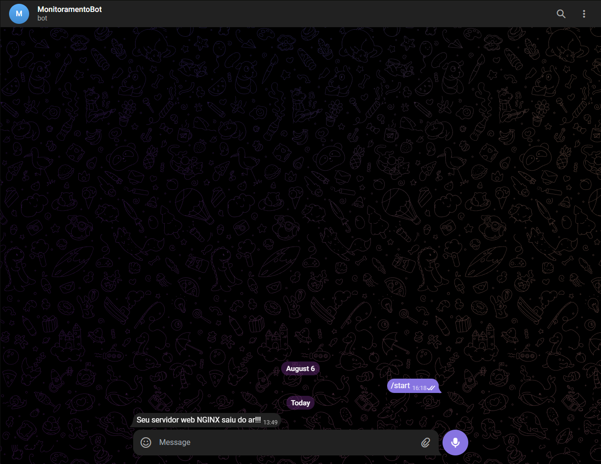

# Testes e Documentação

Nessa etapa, serão realizados testes para verificar se todos os objetivos e as etapas anteriores foram cumpridas corretamente até aqui, nesse caso, o projeto está concluído. Se esse não for o caso, é necessário voltar para as etapas anteriores e identificar onde está o erro. 

## Verificando entrega de página web

Primeiramente, vamos verificar se o Nginx está entregando corretamente a página web. No terminal, digite "**service nginx status**" para verificar o estado do serviço dele. O correto é aparecer escrito "**active (running)**". 

Com o Nginx rodando, tente acessar a página em um navegador ou usando o comando "**ping**". Para isso, precisaremos do IPv4. Digite "**ip -4 a**" para obter essa informação. Vai aparecer logo depois de "inet" e tome cuidado para não usar o endereço do loopback.

Seguindo, podemos acessar o navegador para testar, digite o IP que verificamos e se tudo estiver de acordo, a página HTML que criamos aparecerá na tela.

## Verificando reinicialização automática

Verifique se o serviço do Nginx reinicia automaticamente em caso de erro, de acordo com o que configuramos. Para isso, vamos tentar matar o processo, mas antes precisamos do PID dele.

Para obter o PID, use o comando "**ps -ef | grep nginx**" que listará todos os processos com nginx, nessa lista procure pelo processo com "master process" escrito.

Usando o valor obtido, digite o comando "**kill -9 [PID]**". Dessa forma, o sistema matará o processo do Nginx de forma direta, sem passar pelo desligamento convencional, e nisso a nossa configuração deve reiniciar ele de forma automática. Digite agora "**service nginx status**" novamente para verificar o novo status, que deverá ser algo como iniciando ou ativo.

## Verificando monitoramento

Para isso, primeiro verifique o log de alterações do estado do servidor que criamos, pode-se utilizar o comando "**cat /var/log/monitoramento.log**" (atenção ao buscar o arquivo no diretório correto), deve aparecer escrito algum conteúdo indicando que o serviço está online na última linha, se esse for o caso, significa que deu tudo certo.

Agora vamos parar o serviço do Nginx, use o comando "**service nginx stop**", então espere até no máximo 1 minuto e verifique novamente o arquivo de log, aparecerá uma nova linha escrita ao final do log indicando que o estado do servidor ficou offline.

Além disso, abra o Telegram para conferir se o bot enviou corretamente a mensagem de que o servidor saiu do ar, se sim, isso significa que deu tudo certo, pode iniciar novamente o Nginx com o comando "**service nginx start**" (lembrando de estar como usuário root para executar esses comandos).

Isso finaliza a etapa 4, Configuração do Servidor Web, e o projeto "**Infraestrutura Web com Monitoramento Automatizado**". Obrigado por ler até aqui.